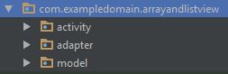
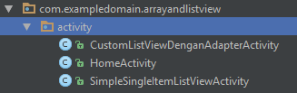
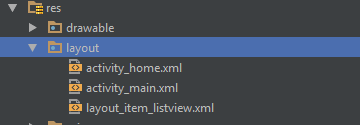
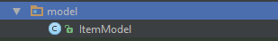
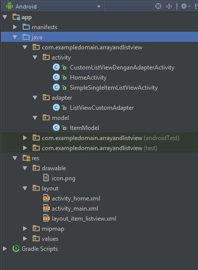

# PerkenalanListViewAndroid

<b>Download source coude </b>

1. Buat Project Bernama <b>ArrayandListView</b>
2. buat package seperti ini :
 

 
caranya klik kanan folder <b>java</b> --> <b>New</b> --> <b>Package</b>
 

 
 
3. Buat activity di dalam package Activity dengan nama Class di bawah ini ( Dengan cara klik kanan --> <b>New</b> --> <b>Activity</b> --> <b>Blank Activity</b> :  

  
4. Buat layout ini ( jika sudah ada tinggal ganti isi xml yang bisa di lihat di source code yang sudah di download : 

 
<b> JANGAN LUPA copy Drawablenya di folder project yang sudah di download</b>
 
5. Ganti setContentView / layout yang ada di dalam Class <b>CustomListViewDenganAdapterActivity</b> dan <b>SimpleSingleItemListViewActivity</b> seperti di bawah ini : 

  
6. Buat Class Model seperti ini, untuk isinya sesuaikan seperti di source code project yang sudah di download : 

  
7. Buat Class Adapater seperti di bawah ini, untuk isinya sesuaikan seperti di source code project yang sudah di download : 

  
8. Final Struktur Projectnya : 

